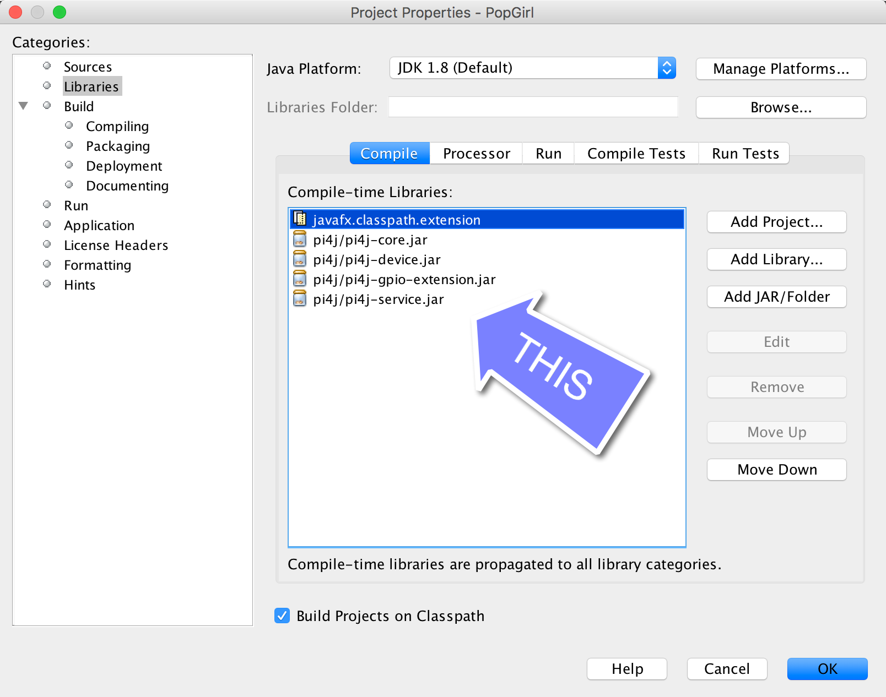

The PopGirl app is written in Java using NetBeans 8.2 and requires the addition of pi4j jar files so that it will compile on your non-RaspberryPi device for limited UI testing.  The required JAR files can be downloaded from: http://pi4j.com/download.html
See image below.  

